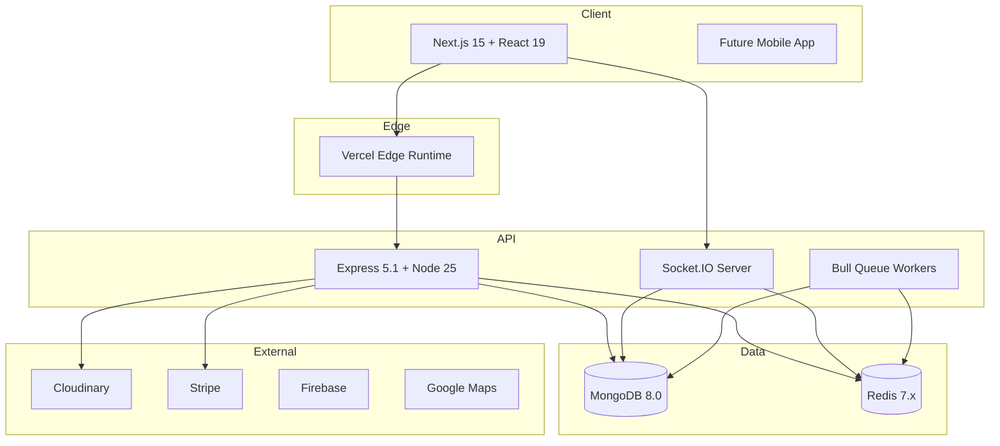
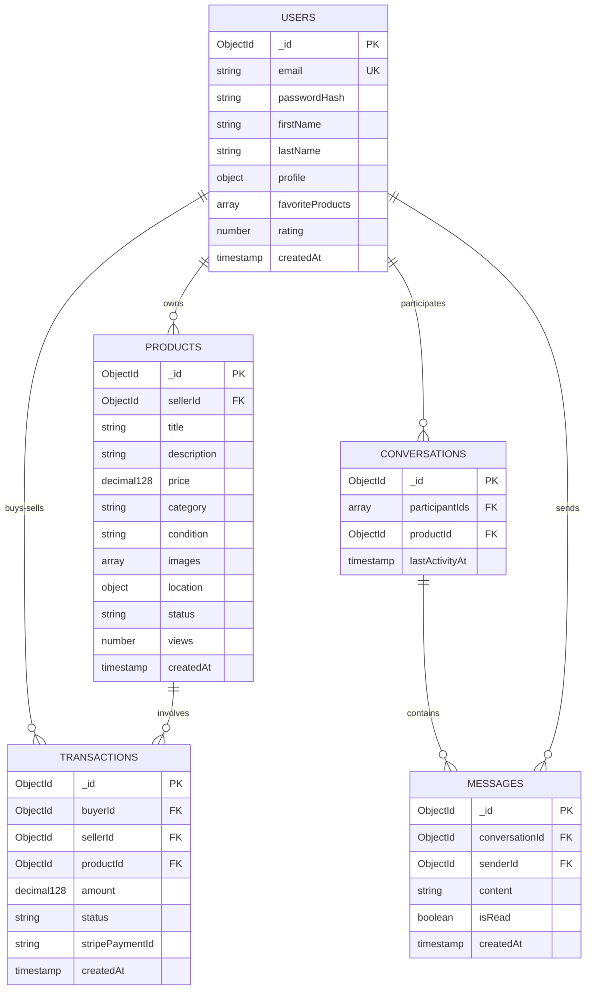

# Architecture GreenTrade - Marketplace Type Vinted

## 📋 Vue d'ensemble du projet

**Contexte :** Projet d'école de 4 mois - Marketplace de seconde main type Vinted  
**Équipe :** 4 personnes (Irina: DevOps, Bahloul: Front, Michée: Back, Luc: Doc/Jira)  
**Focus :** Back-end solide avec Clean Architecture, front-end fonctionnel mais secondaire  
**Approche :** Modulaire et feature-rich

**Note :** Le repository a été nettoyé et les scripts de configuration ont été consolidés. Pour les instructions d'initialisation et démarrage, consultez le [`README.md`](README.md) principal. Si vous avez besoin d'anciens scripts ou variantes docker-compose, ils ont été archivés ou supprimés pour garder le repo minimal.

---

## 🎯 Stack Technologique 2025 (Dernières Versions)

### Back-end
- **Runtime:** Node.js 25.x (TypeScript natif, performance améliorée)
- **Framework:** Express 5.1.0 (support async/await natif, router amélioré)
- **Language:** TypeScript 5.7+ (decorators, type inference améliorés)
- **ODM:** Mongoose 8.x (typage TypeScript natif)
- **Base de données:** MongoDB 8.0+ (Time Series, queryable encryption)

### Front-end
- **Framework:** Next.js 15.1+ (Turbopack, async request APIs)
- **UI Library:** React 19.2 (React Compiler, `use` hook, Server Actions)
- **Styling:** Tailwind CSS 4.0 (nouvelle engine, CSS-first config)
- **Components:** shadcn/ui (composants React 19 ready)

### Nouveautés Importantes

#### Express 5.1 🆕
- Support natif des async handlers (plus besoin de try/catch partout)
- Router parameter modifiers (`?`, `*`, `+`)
- Meilleure gestion des promises rejetées
- `next('router')` pour sortir proprement des routers

#### Next.js 15 🆕
- **Async Request APIs**: `params`, `searchParams`, `cookies()`, `headers()` sont maintenant async
- **Turbopack**: Compilation ultra-rapide (95% plus rapide que Webpack)
- **React 19 Support**: Full support du nouveau compiler et des features
- **Server Actions améliorés**: Meilleure intégration avec forms

#### React 19 🆕
- **React Compiler**: Optimisation automatique (memoization auto)
- **`use` Hook**: Lecture de ressources async (Context, Promises)
- **`useActionState`**: Gestion des Server Actions avec état
- **`useOptimistic`**: UI optimiste pour mutations
- **Server Components matures**: Production-ready

#### Node.js 25 🆕
- Support TypeScript natif (pas besoin de transpiler)
- Performance améliorée (V8 12.x)
- Built-in test runner amélioré
- Meilleure gestion des permissions

---

## 🏗️ Architecture Globale

### Structure Monorepo

```
green_trade/
├── packages/
│   ├── backend/              # API Node.js + Express (Clean Architecture)
│   ├── frontend/             # Application Next.js 15 + React 19
│   └── shared/               # Types TypeScript partagés
├── docker/                   # Configurations Docker
├── docs/                     # Documentation projet
├── .taskmaster/              # Task Master pour gestion projet
└── scripts/                  # Scripts d'automatisation
```

### Diagramme Architecture Système



---

## 🎯 Architecture Back-end - Clean Architecture Pragmatique

### Principes Adaptés

1. **3 Couches Principales**: Domain, Application, Infrastructure
2. **Dependency Injection**: Utilisation de `awilix` ou injection manuelle
3. **Async/Await Natif**: Profiter d'Express 5.1
4. **Type Safety**: TypeScript strict mode
5. **Testabilité**: Isolation des use cases

### Structure Back-end Détaillée

```
packages/backend/
├── src/
│   ├── domain/                    # COUCHE DOMAINE
│   │   ├── entities/
│   │   │   ├── User.ts
│   │   │   ├── Product.ts
│   │   │   ├── Conversation.ts
│   │   │   ├── Message.ts
│   │   │   └── Transaction.ts
│   │   ├── value-objects/
│   │   │   ├── Email.ts
│   │   │   ├── Price.ts
│   │   │   ├── Location.ts
│   │   │   └── ProductStatus.ts
│   │   ├── repositories/          # Interfaces
│   │   │   ├── IUserRepository.ts
│   │   │   ├── IProductRepository.ts
│   │   │   └── IMessageRepository.ts
│   │   └── errors/
│   │       └── DomainErrors.ts
│   │
│   ├── application/               # COUCHE APPLICATION
│   │   ├── use-cases/
│   │   │   ├── auth/
│   │   │   │   ├── RegisterUser.ts
│   │   │   │   ├── LoginUser.ts
│   │   │   │   └── RefreshToken.ts
│   │   │   ├── products/
│   │   │   │   ├── CreateProduct.ts
│   │   │   │   ├── UpdateProduct.ts
│   │   │   │   ├── SearchProducts.ts
│   │   │   │   └── GetProductById.ts
│   │   │   ├── messages/
│   │   │   │   ├── SendMessage.ts
│   │   │   │   ├── GetConversation.ts
│   │   │   │   └── MarkAsRead.ts
│   │   │   └── transactions/
│   │   │       ├── CreateTransaction.ts
│   │   │       └── ProcessPayment.ts
│   │   ├── dto/
│   │   │   ├── CreateProductDto.ts
│   │   │   └── UserResponseDto.ts
│   │   └── services/
│   │       ├── IAuthService.ts
│   │       └── INotificationService.ts
│   │
│   ├── infrastructure/            # COUCHE INFRASTRUCTURE
│   │   ├── database/
│   │   │   ├── mongodb/
│   │   │   │   ├── models/
│   │   │   │   │   ├── UserModel.ts
│   │   │   │   │   ├── ProductModel.ts
│   │   │   │   │   └── MessageModel.ts
│   │   │   │   ├── repositories/
│   │   │   │   │   ├── MongoUserRepository.ts
│   │   │   │   │   └── MongoProductRepository.ts
│   │   │   │   └── connection.ts
│   │   │   └── redis/
│   │   │       └── RedisClient.ts
│   │   ├── external-services/
│   │   │   ├── cloudinary/
│   │   │   ├── stripe/
│   │   │   ├── firebase/
│   │   │   └── google-maps/
│   │   ├── auth/
│   │   │   ├── JwtService.ts
│   │   │   └── PasswordHasher.ts
│   │   ├── websocket/
│   │   │   └── SocketIOServer.ts
│   │   └── queue/
│   │       ├── EmailQueue.ts
│   │       └── NotificationQueue.ts
│   │
│   ├── presentation/              # COUCHE PRESENTATION
│   │   ├── http/
│   │   │   ├── routes/
│   │   │   │   ├── auth.routes.ts
│   │   │   │   ├── products.routes.ts
│   │   │   │   ├── messages.routes.ts
│   │   │   │   └── users.routes.ts
│   │   │   ├── controllers/
│   │   │   │   ├── AuthController.ts
│   │   │   │   ├── ProductController.ts
│   │   │   │   └── MessageController.ts
│   │   │   ├── middlewares/
│   │   │   │   ├── authentication.ts
│   │   │   │   ├── authorization.ts
│   │   │   │   ├── validation.ts
│   │   │   │   ├── errorHandler.ts
│   │   │   │   └── rateLimiter.ts
│   │   │   └── validators/
│   │   │       ├── productSchema.ts
│   │   │       └── userSchema.ts
│   │   └── websocket/
│   │       └── socketHandlers.ts
│   │
│   ├── config/
│   │   ├── index.ts
│   │   └── env.ts
│   │
│   └── di/
│       └── container.ts
│
├── tests/
│   ├── unit/
│   ├── integration/
│   └── e2e/
│
├── package.json
├── tsconfig.json
└── .env.example
```

### Exemple de Use Case avec Express 5.1

```typescript
// application/use-cases/products/CreateProduct.ts
export class CreateProduct {
  constructor(
    private productRepository: IProductRepository,
    private imageService: IImageService
  ) {}

  // Express 5.1 gère automatiquement les erreurs async
  async execute(dto: CreateProductDto): Promise<Product> {
    // Validation
    const validatedDto = ProductSchema.parse(dto);
    
    // Upload images
    const imageUrls = await this.imageService.uploadMany(
      validatedDto.images
    );
    
    // Créer entité
    const product = new Product({
      ...validatedDto,
      images: imageUrls,
      status: ProductStatus.ACTIVE
    });
    
    // Sauvegarder
    return await this.productRepository.save(product);
  }
}
```

### Controller Express 5.1 avec Async

```typescript
// presentation/http/controllers/ProductController.ts
export class ProductController {
  constructor(
    private createProduct: CreateProduct,
    private getProducts: GetProducts
  ) {}

  // Plus besoin de try/catch, Express 5.1 les gère
  create = async (req: Request, res: Response) => {
    const product = await this.createProduct.execute(req.body);
    res.status(201).json(product);
  };

  list = async (req: Request, res: Response) => {
    const { page = 1, limit = 20 } = req.query;
    const products = await this.getProducts.execute({ 
      page: Number(page), 
      limit: Number(limit) 
    });
    res.json(products);
  };
}
```

---

## 🗄️ Base de Données MongoDB 8.0

### Collections et Relations



### Indexes MongoDB 8.0

```javascript
// MongoDB 8.0 - Indexes optimisés
db.users.createIndex({ email: 1 }, { unique: true });
db.users.createIndex({ createdAt: -1 });

db.products.createIndex({ sellerId: 1, status: 1 });
db.products.createIndex({ category: 1, status: 1 });
db.products.createIndex({ 
  title: "text", 
  description: "text" 
}, { 
  weights: { title: 10, description: 5 }
});
// Recherche géospatiale
db.products.createIndex({ 
  "location.coordinates": "2dsphere" 
});
db.products.createIndex({ createdAt: -1 });
db.products.createIndex({ price: 1 });

db.conversations.createIndex({ participantIds: 1 });
db.conversations.createIndex({ productId: 1 });
db.conversations.createIndex({ lastActivityAt: -1 });

db.messages.createIndex({ 
  conversationId: 1, 
  createdAt: -1 
});
db.messages.createIndex({ senderId: 1 });

db.transactions.createIndex({ buyerId: 1 });
db.transactions.createIndex({ sellerId: 1 });
db.transactions.createIndex({ status: 1 });
```

### Mongoose Schema avec TypeScript

```typescript
// infrastructure/database/mongodb/models/ProductModel.ts
import { Schema, model, type InferSchemaType } from 'mongoose';

const productSchema = new Schema({
  sellerId: { 
    type: Schema.Types.ObjectId, 
    ref: 'User', 
    required: true 
  },
  title: { 
    type: String, 
    required: true, 
    trim: true, 
    maxlength: 100 
  },
  description: { 
    type: String, 
    required: true, 
    maxlength: 2000 
  },
  price: { 
    type: Schema.Types.Decimal128, 
    required: true 
  },
  category: { 
    type: String, 
    enum: ['vetements', 'electronique', 'maison', 'sport', 'autre'],
    required: true 
  },
  condition: { 
    type: String, 
    enum: ['neuf', 'excellent', 'bon', 'acceptable'],
    required: true 
  },
  images: [{ 
    type: String, 
    validate: {
      validator: (v: string) => v.startsWith('https://'),
      message: 'Image URL must be HTTPS'
    }
  }],
  location: {
    type: { type: String, enum: ['Point'], default: 'Point' },
    coordinates: { type: [Number], index: '2dsphere' },
    address: String,
    city: String,
    postalCode: String
  },
  status: { 
    type: String, 
    enum: ['active', 'sold', 'reserved', 'archived'],
    default: 'active' 
  },
  views: { type: Number, default: 0 },
  tags: [String]
}, { 
  timestamps: true,
  toJSON: { virtuals: true },
  toObject: { virtuals: true }
});

// Type inference automatique
type ProductDocument = InferSchemaType<typeof productSchema>;

export const ProductModel = model<ProductDocument>('Product', productSchema);
```

---

## 🎨 Architecture Front-end - Next.js 15 + React 19

### Structure Recommandée

```
packages/frontend/
├── app/                          # Next.js 15 App Router
│   ├── layout.tsx                # Root layout avec React 19
│   ├── page.tsx                  # Homepage (Server Component)
│   ├── auth/
│   │   ├── login/
│   │   │   └── page.tsx
│   │   └── register/
│   │       └── page.tsx
│   ├── products/
│   │   ├── page.tsx              # Liste produits (Server Component)
│   │   ├── [id]/
│   │   │   └── page.tsx          # Détail produit
│   │   └── new/
│   │       └── page.tsx          # Créer produit (avec Server Actions)
│   ├── profile/
│   │   └── page.tsx
│   └── messages/
│       └── page.tsx
│
├── components/
│   ├── ui/                       # shadcn/ui components
│   ├── features/
│   │   ├── ProductCard.tsx
│   │   ├── ProductFilters.tsx
│   │   ├── ChatBox.tsx           # Avec Socket.IO
│   │   └── UserProfile.tsx
│   └── layout/
│       ├── Header.tsx
│       └── Footer.tsx
│
├── lib/
│   ├── actions/                  # Server Actions React 19
│   │   ├── auth.actions.ts
│   │   ├── product.actions.ts
│   │   └── message.actions.ts
│   ├── api/                      # API client
│   │   └── client.ts
│   └── utils/
│
├── hooks/
│   ├── use-auth.ts
│   ├── use-products.ts
│   ├── use-websocket.ts
│   └── use-optimistic-update.ts  # React 19 useOptimistic
│
├── types/
└── styles/
```

### Exemple Server Component Next.js 15

```typescript
// app/products/page.tsx - Server Component
import { Suspense } from 'react';
import { ProductCard } from '@/components/features/ProductCard';
import { ProductFilters } from '@/components/features/ProductFilters';

// Params et searchParams sont async en Next.js 15
export default async function ProductsPage({
  searchParams,
}: {
  searchParams: Promise<{ category?: string; page?: string }>;
}) {
  // Await obligatoire en Next.js 15
  const params = await searchParams;
  const category = params.category;
  const page = Number(params.page) || 1;

  // Fetch côté serveur (automatiquement caché)
  const products = await fetch(
    `${process.env.API_URL}/products?category=${category}&page=${page}`,
    { 
      next: { revalidate: 60 } // Revalidate toutes les 60s
    }
  ).then(res => res.json());

  return (
    <div className="container mx-auto px-4">
      <h1 className="text-3xl font-bold my-8">Produits</h1>
      
      <div className="grid grid-cols-12 gap-6">
        <aside className="col-span-3">
          <ProductFilters />
        </aside>
        
        <main className="col-span-9">
          <Suspense fallback={<ProductsSkeleton />}>
            <div className="grid grid-cols-3 gap-4">
              {products.map((product) => (
                <ProductCard key={product.id} product={product} />
              ))}
            </div>
          </Suspense>
        </main>
      </div>
    </div>
  );
}
```

### Server Actions React 19

```typescript
// lib/actions/product.actions.ts
'use server';

import { revalidatePath } from 'next/cache';
import { z } from 'zod';

const productSchema = z.object({
  title: z.string().min(3).max(100),
  description: z.string().min(10).max(2000),
  price: z.number().positive(),
  category: z.enum(['vetements', 'electronique', 'maison', 'sport', 'autre']),
  condition: z.enum(['neuf', 'excellent', 'bon', 'acceptable']),
});

export async function createProduct(
  prevState: any,
  formData: FormData
) {
  // Validation
  const validatedFields = productSchema.safeParse({
    title: formData.get('title'),
    description: formData.get('description'),
    price: Number(formData.get('price')),
    category: formData.get('category'),
    condition: formData.get('condition'),
  });

  if (!validatedFields.success) {
    return {
      errors: validatedFields.error.flatten().fieldErrors,
      message: 'Validation échouée',
    };
  }

  try {
    // Appel API
    const response = await fetch(`${process.env.API_URL}/products`, {
      method: 'POST',
      headers: {
        'Content-Type': 'application/json',
        'Authorization': `Bearer ${getToken()}`,
      },
      body: JSON.stringify(validatedFields.data),
    });

    if (!response.ok) throw new Error('Erreur création produit');

    // Revalider le cache
    revalidatePath('/products');
    
    return { 
      success: true, 
      message: 'Produit créé avec succès' 
    };
  } catch (error) {
    return { 
      success: false, 
      message: 'Erreur lors de la création' 
    };
  }
}
```

### Composant Client avec useActionState (React 19)

```typescript
// app/products/new/page.tsx
'use client';

import { useActionState } from 'react';
import { createProduct } from '@/lib/actions/product.actions';

export default function NewProductPage() {
  const [state, formAction, isPending] = useActionState(
    createProduct,
    { success: false, message: '' }
  );

  return (
    <form action={formAction} className="max-w-2xl mx-auto p-6">
      <h1 className="text-2xl font-bold mb-6">Créer un produit</h1>
      
      <div className="space-y-4">
        <div>
          <label htmlFor="title" className="block mb-2">Titre</label>
          <input
            type="text"
            id="title"
            name="title"
            className="w-full border rounded px-3 py-2"
            required
          />
          {state.errors?.title && (
            <p className="text-red-500 text-sm mt-1">
              {state.errors.title}
            </p>
          )}
        </div>

        <div>
          <label htmlFor="price" className="block mb-2">Prix</label>
          <input
            type="number"
            id="price"
            name="price"
            step="0.01"
            className="w-full border rounded px-3 py-2"
            required
          />
        </div>

        <button
          type="submit"
          disabled={isPending}
          className="bg-blue-600 text-white px-6 py-2 rounded disabled:opacity-50"
        >
          {isPending ? 'Création...' : 'Créer le produit'}
        </button>
      </div>

      {state.message && (
        <div className={`mt-4 p-4 rounded ${
          state.success ? 'bg-green-100 text-green-800' : 'bg-red-100 text-red-800'
        }`}>
          {state.message}
        </div>
      )}
    </form>
  );
}
```

### Hook use() pour Context (React 19)

```typescript
// lib/context/auth-context.tsx
'use client';

import { createContext, use, type ReactNode } from 'react';

const AuthContext = createContext<AuthState | null>(null);

export function AuthProvider({ 
  children,
  authPromise 
}: { 
  children: ReactNode;
  authPromise: Promise<AuthState>;
}) {
  // Le hook use() peut lire des Promises
  const auth = use(authPromise);
  
  return (
    <AuthContext value={auth}>
      {children}
    </AuthContext>
  );
}

export function useAuth() {
  const auth = use(AuthContext);
  if (!auth) throw new Error('useAuth doit être utilisé dans AuthProvider');
  return auth;
}
```

---

## 🔐 Sécurité & Performance

### Sécurité Renforcée

```typescript
// Express 5.1 avec middlewares de sécurité
import helmet from 'helmet';
import rateLimit from 'express-rate-limit';
import mongoSanitize from 'express-mongo-sanitize';

app.use(helmet({
  contentSecurityPolicy: {
    directives: {
      defaultSrc: ["'self'"],
      imgSrc: ["'self'", 'https://res.cloudinary.com'],
      scriptSrc: ["'self'", "'unsafe-inline'"],
    },
  },
}));

// Rate limiting
const limiter = rateLimit({
  windowMs: 15 * 60 * 1000, // 15 minutes
  max: 100, // 100 requêtes max
  standardHeaders: true,
  legacyHeaders: false,
});

app.use('/api/', limiter);

// Protection NoSQL injection
app.use(mongoSanitize());

// CORS configuré
app.use(cors({
  origin: process.env.FRONTEND_URL,
  credentials: true,
}));
```

### Caching Strategy

```typescript
// Redis pour cache + sessions
import Redis from 'ioredis';

const redis = new Redis({
  host: process.env.REDIS_HOST,
  port: Number(process.env.REDIS_PORT),
  password: process.env.REDIS_PASSWORD,
});

// Cache wrapper
async function cached<T>(
  key: string,
  ttl: number,
  fn: () => Promise<T>
): Promise<T> {
  // Check cache
  const cached = await redis.get(key);
  if (cached) return JSON.parse(cached);
  
  // Execute
  const result = await fn();
  
  // Store
  await redis.setex(key, ttl, JSON.stringify(result));
  
  return result;
}

// Usage
const products = await cached(
  `products:category:${category}`,
  300, // 5 min
  () => ProductModel.find({ category })
);
```

---

## 📊 Plan de Développement (4 mois)

### Sprint 0 - Setup (Semaine 1)
- Setup monorepo avec pnpm workspaces
- Configuration TypeScript + ESLint + Prettier
- Docker Compose (MongoDB, Redis, API)
- CI/CD GitHub Actions basique

### Sprint 1 - Auth & Users (Semaine 2-3)
- Use cases Auth complets
- JWT + Refresh tokens
- Pages login/register Next.js 15
- Server Actions pour auth
- Tests unitaires

### Sprint 2 - Produits Core (Semaine 4-5)
- CRUD produits back-end
- Upload images Cloudinary
- Catalogue produits (Server Components)
- Recherche + filtres
- Server Actions pour CRUD

### Sprint 3 - Messaging Real-time (Semaine 6-7)
- Socket.IO côté serveur
- Chat real-time
- Interface chat (Client Component)
- Notifications temps réel

### Sprint 4 - Transactions & Paiement (Semaine 8-9)
- Intégration Stripe
- Server Actions pour paiement
- Gestion statuts commandes
- Webhooks Stripe

### Sprint 5 - Features Avancées (Semaine 10-12)
- Recherche géographique
- Filtres avancés avec `useOptimistic`
- Notifications push Firebase
- Système de favoris
- Ratings

### Sprint 6 - Optimisations (Semaine 13-14)
- React Compiler optimizations
- Turbopack build optimizations
- Tests e2e Playwright
- Documentation API Swagger
- Performance monitoring

### Sprint 7 - Polish & Deploy (Semaine 15-16)
- Deployment Vercel (front)
- Deployment Railway (back)
- Tests utilisateurs
- Bugfixes finaux
- Préparation présentation

---

## 🛠️ Configuration Recommandée

### package.json (Backend)

```json
{
  "name": "@greentrade/backend",
  "version": "1.0.0",
  "type": "module",
  "engines": {
    "node": ">=25.0.0"
  },
  "scripts": {
    "dev": "tsx watch src/index.ts",
    "build": "tsc",
    "start": "node dist/index.js",
    "test": "vitest",
    "test:e2e": "vitest run --config vitest.config.e2e.ts"
  },
  "dependencies": {
    "express": "^5.1.0",
    "mongoose": "^8.9.0",
    "zod": "^3.24.1",
    "jsonwebtoken": "^9.0.2",
    "bcrypt": "^5.1.1",
    "socket.io": "^4.8.1",
    "ioredis": "^5.4.1",
    "bull": "^4.16.3",
    "awilix": "^12.0.1"
  },
  "devDependencies": {
    "@types/express": "^5.0.0",
    "@types/node": "^25.0.0",
    "typescript": "^5.7.2",
    "tsx": "^4.19.0",
    "vitest": "^2.1.8"
  }
}
```

### package.json (Frontend)

```json
{
  "name": "@greentrade/frontend",
  "version": "1.0.0",
  "type": "module",
  "scripts": {
    "dev": "next dev --turbopack",
    "build": "next build",
    "start": "next start",
    "lint": "next lint"
  },
  "dependencies": {
    "next": "^15.1.8",
    "react": "^19.2.0",
    "react-dom": "^19.2.0",
    "zod": "^3.24.1",
    "socket.io-client": "^4.8.1",
    "@radix-ui/react-dialog": "^1.1.2",
    "tailwindcss": "^4.0.0"
  },
  "devDependencies": {
    "@types/node": "^25.0.0",
    "@types/react": "^19.0.0",
    "typescript": "^5.7.2",
    "eslint": "^9.0.0",
    "eslint-config-next": "^15.1.8"
  }
}
```

### tsconfig.json

```json
{
  "compilerOptions": {
    "target": "ES2024",
    "lib": ["ES2024"],
    "module": "NodeNext",
    "moduleResolution": "NodeNext",
    "strict": true,
    "esModuleInterop": true,
    "skipLibCheck": true,
    "forceConsistentCasingInFileNames": true,
    "resolveJsonModule": true,
    "outDir": "./dist",
    "rootDir": "./src",
    "types": ["node"]
  },
  "include": ["src/**/*"],
  "exclude": ["node_modules", "dist"]
}
```

---

## 📚 Ressources & Documentation

### Documentation Officielle
- [Express 5.1 Migration Guide](https://expressjs.com/en/guide/migrating-5.html)
- [Next.js 15 Docs](https://nextjs.org/docs)
- [React 19 Release Notes](https://react.dev/blog/2024/12/05/react-19)
- [Node.js 25 Changelog](https://nodejs.org/en/blog/release/)
- [MongoDB 8.0 Features](https://www.mongodb.com/docs/manual/release-notes/8.0/)

### Guides Architecture
- Clean Architecture (Robert C. Martin)
- Domain-Driven Design Light
- SOLID Principles

---

## ⚠️ Points d'Attention pour l'Équipe

### Pour Michée (Back-end)
- Profiter des async handlers d'Express 5.1 (plus de try/catch partout)
- Structurer les use cases de façon isolée et testable
- Bien typer avec TypeScript pour faciliter le debug

### Pour Bahloul (Front-end)
- Utiliser Server Components par défaut (Next.js 15)
- Server Actions pour toutes les mutations (React 19)
- Client Components uniquement quand nécessaire (interactivité)
- React Compiler optimisera automatiquement

### Pour Irina (DevOps)
- Docker Compose pour dev local
- CI/CD avec GitHub Actions
- Déploiement: Vercel (front) + Railway/Render (back)
- Monitoring avec Sentry

### Pour Luc (Doc/PM)
- Documentation API avec Swagger/OpenAPI
- ADR (Architecture Decision Records) pour décisions importantes
- Jira avec sprints de 2 semaines
- Revues de code obligatoires

---

## 🎯 Critères de Succès

### Techniques ✅
- Architecture Clean respectée
- TypeScript strict mode
- 70%+ couverture tests
- CI/CD fonctionnel
- Performance < 500ms endpoints
- 0 vulnérabilités critiques

### Fonctionnels ✅
- Auth complète + refresh tokens
- CRUD produits avec images
- Recherche + filtres temps réel
- Chat Socket.IO fonctionnel
- Paiement Stripe (test mode)
- Déployé en production

### Pédagogiques ✅
- Clean Architecture maîtrisée
- Technologies 2025 utilisées
- Tests automatisés
- DevOps moderne
- Documentation complète
- Collaboration agile efficace